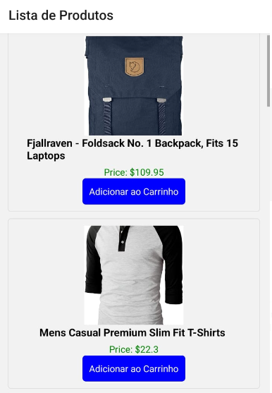

# Aplicativo de Compras em React Native

#  :star: About the project

Este é um aplicativo de exemplo em React Native que demonstra como criar uma lista de produtos e um carrinho de compras. Os principais recursos incluem adicionar produtos ao carrinho, atualizar a quantidade e remover produtos.

## Estrutura de Diretórios

- `src`: Contém o código-fonte principal do aplicativo.
  - `components`: Componentes reutilizáveis.
    - `ProductItem.tsx`: Componente que exibe informações de um produto.
  - `navigation`: Configuração de navegação.
    - `AppNavigator.tsx`: Configuração de navegação usando React Navigation.
  - `screens`: Telas do aplicativo.
    - `checkout`: Telas relacionadas ao carrinho de compras.
      - `CartScreen.tsx`: Tela que exibe os produtos no carrinho e permite atualizar a quantidade.
    - `product`: Telas relacionadas aos produtos.
      - `ProductsScreen.tsx`: Tela inicial que exibe a lista de produtos e permite adicioná-los ao carrinho.
  - `services`: Funções de serviço para buscar dados ou realizar operações.
  - `App.tsx`: Ponto de entrada do aplicativo.

## Funcionalidades

-  Cosumo de api Fake Store
- Lista de produtos com informações como imagem, título e preço.
- Adição de produtos ao carrinho.
- Exibição do carrinho de compras com produtos, quantidade e preços totais.
- Atualização da quantidade de produtos no carrinho.
- Remoção de produtos do carrinho.

## Configuração

Certifique-se de ter o ambiente de desenvolvimento React Native configurado. Você pode instalar as dependências usando:

Isso abrirá a interface de desenvolvimento do Expo, onde você pode escolher entre executar o aplicativo em um emulador ou em um dispositivo físico.

## Bibliotecas Utilizadas

- React Native: Framework para desenvolvimento de aplicativos móveis.
- React Navigation: Gerenciamento de navegação no aplicativo.
- Expo: Plataforma para desenvolvimento rápido de aplicativos móveis.
- Javascript
- node.js
- jest

## Contribuindo

Sinta-se à vontade para contribuir, abrir problemas (issues) ou fazer sugestões para melhorar este aplicativo de exemplo.

# :pushpin: Author
Monalysa Klauck Yoshikawa
[Linkedin] : <https://www.linkedin.com/in/monalysa-yoshikawa/>